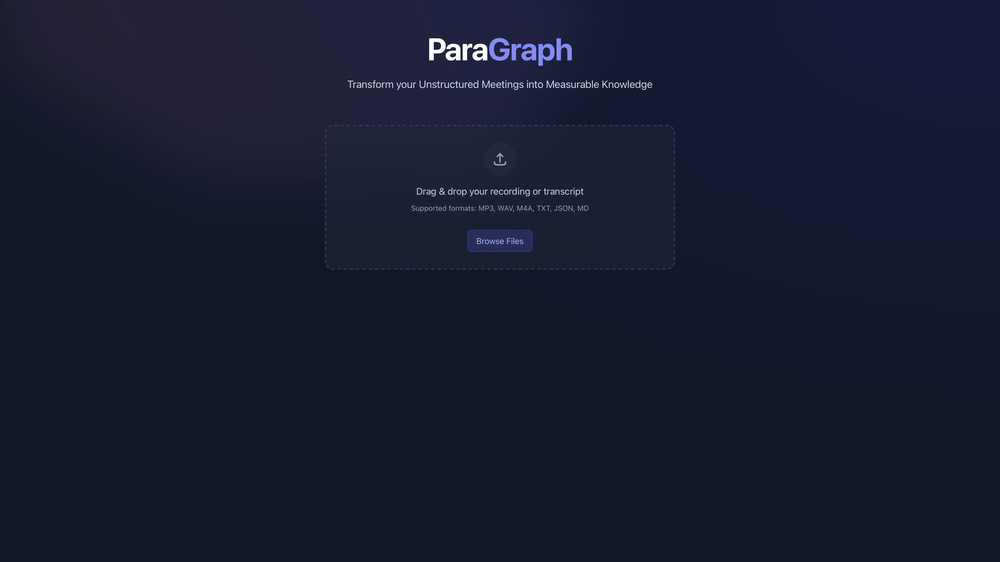
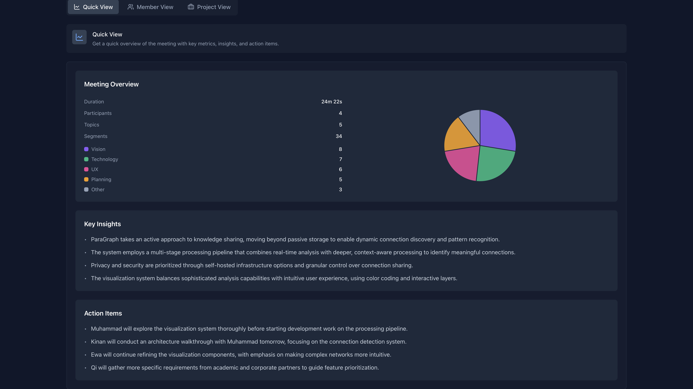
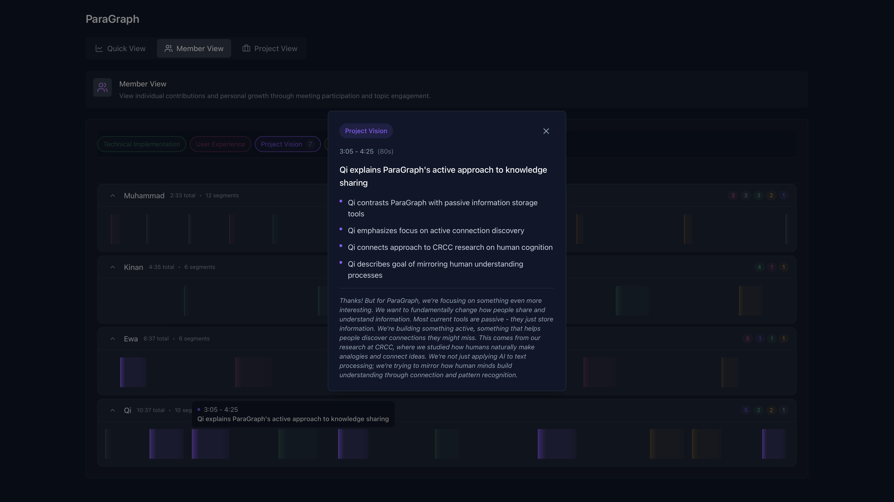
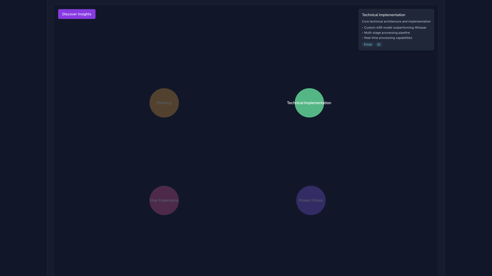
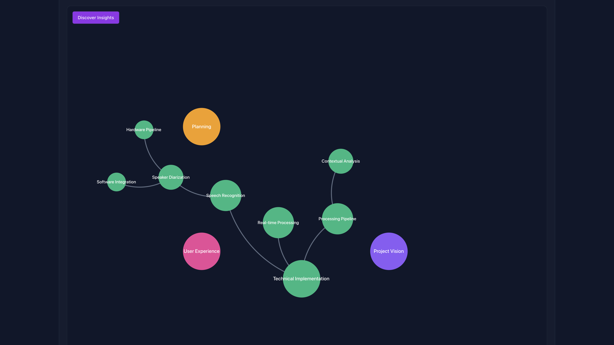
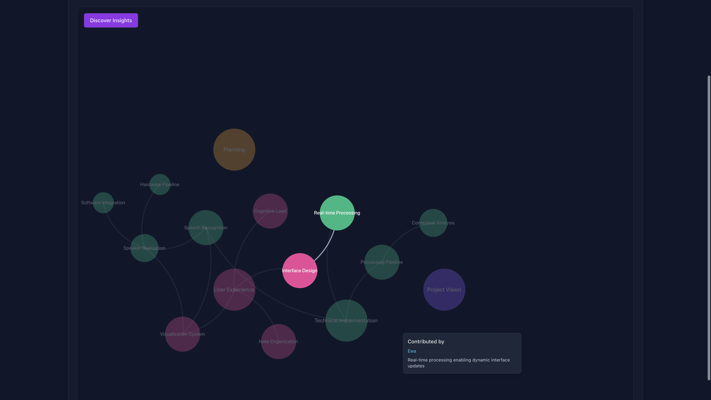
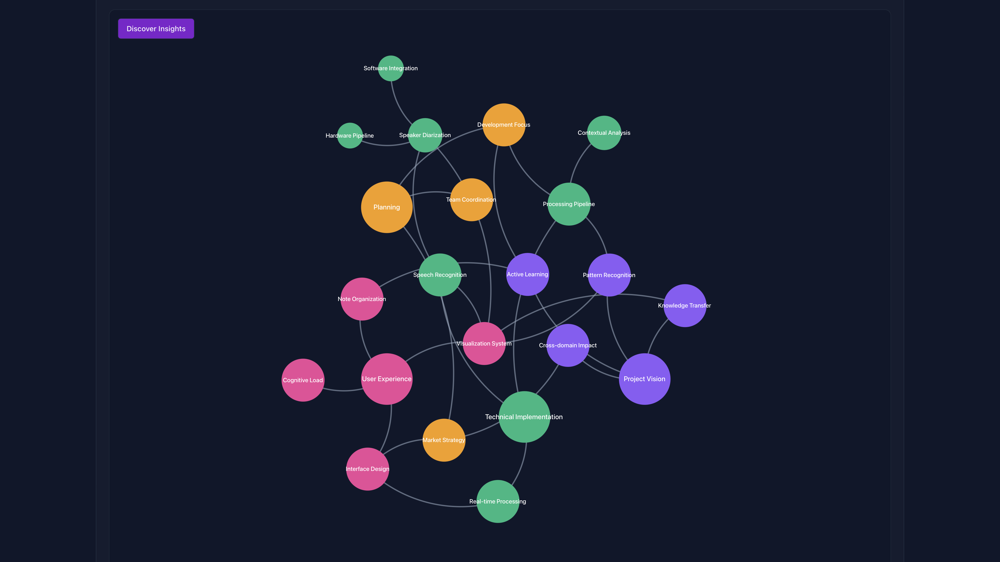
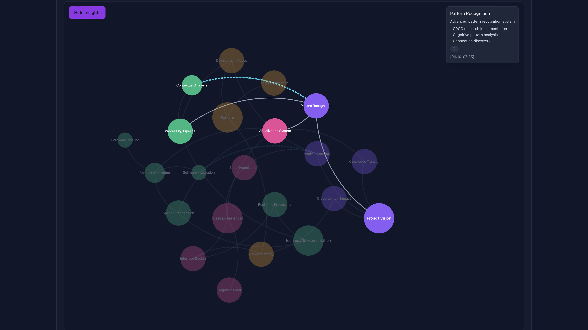
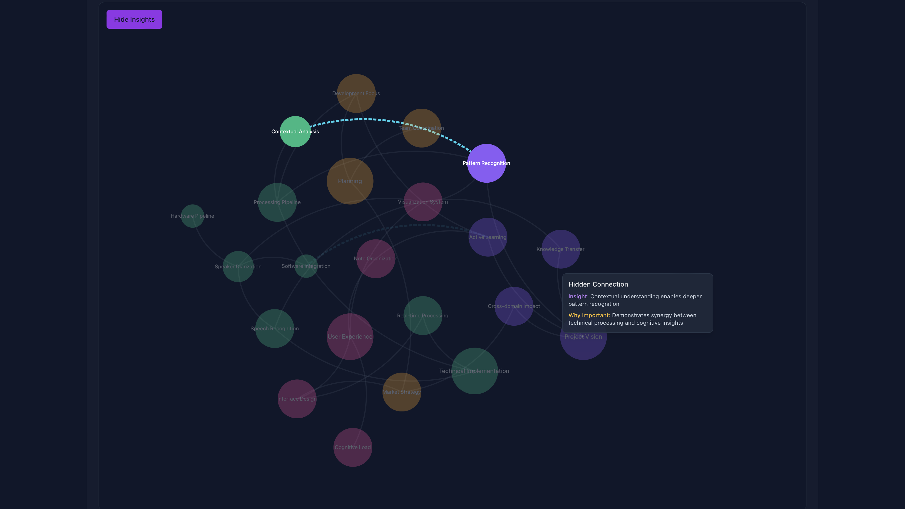

# ParaGraph

## 1. Getting Started

### Overview

ParaGraph transforms your unstructured meetings into measurable knowledge through an interactive visualization system. This manual will guide you through its key features and functionality.

### Initial Setup

- Navigate to the landing page: https://graph.paraparas.com/

### Uploading Content

- Upload Meeting Recording (Coming Soon)
  - Support for various audio formats
  - Automatic speaker diarization/identification
- Upload Transcript
  - Supported formats: TXT, DOCX, PDF
  - Required format: Speaker labels (e.g., from Google Meet)

## 2. QuickView

### Meeting Overview

The QuickView provides an immediate summary of your meeting:

- Duration and participant count
- Topic distribution with interactive pie chart
- Key insights & Action items

## 3. MemberView

### Timeline Navigation

The MemberView provides a detailed chronological visualization of your meeting:

- Topic Filter
  - Select topics to highlight
  - Multiple selection supported
- Speaker Lanes
  - Collapsable individual timelines per speaker
  - Basic statistics: speaker name, speech duration, covered topics
- Interactive Segments
  - Hover over topics for brief summaries
  - Click segments for detailed summaries

## 4. ProjectView

### Knowledge Graph

The ProjectView displays your meeting content as an interactive knowledge graph:

- Extracted and categorized topics and subtopics by AI
- Explicit and implicit connections through analogy-making

### Connection Types

1. Explicit Connections
   - Solid lines
   - Speaker attribution
2. Hidden Connections
   - Dashed lines
   - AI-discovered insights

## 5. Advanced Features

### Discover Insights

The "Discover Insights" feature reveals hidden connections in your knowledge graph:

1. Click the purple "Discover Insights" button
2. New connections appear as dashed lines
3. Hover over connections to view:
   - Connection context
   - Importance rating
   - Related concepts

### Navigation Tips

1. Zoom Controls
   - Use mouse wheel to zoom
   - Double-click to focus
2. Pan Controls
   - Click and drag to pan

## Support

For additional assistance: qc@paraparas.com

------

© 2024 Para. All rights reserved. Version 1.0